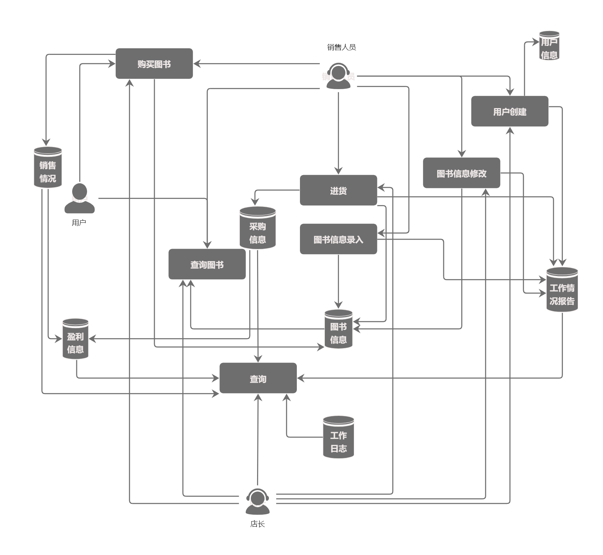
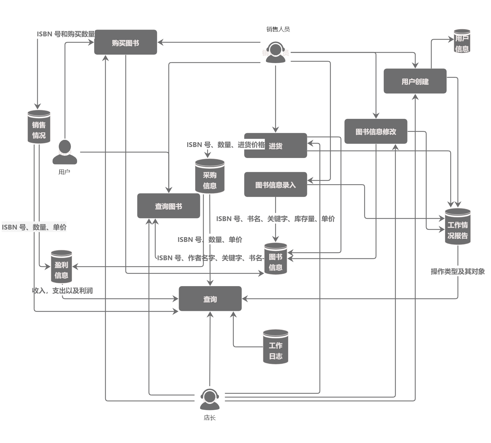

# bookstore2024 需求文档
## 业务流图

## 数据流图

## 数据词典
### 数据流
- ISBN 号：20 个字符
- 书名：60个字符
- 作者：60个字符
- 关键字：60个字符
- 库存量：整型
- 数量：整型
- 单价：非负实型
- 收入：非负实型
- 支出：非负实型
- 利润：非负实型
- 图书信息：ISBN 号、书名、作者、关键字、库存量、单价
- 采购信息：ISBN 号、数量、单价
- 销售情况：ISBN 号、数量、单价
- 盈利信息：收入、支出、利润
- 工作情况报告：操作类型及其对象
- 工作日志：系统的整体工作日志

### 文件流
- 图书信息：ISBN 号、书名、作者、关键字、库存量、单价
- 采购信息：ISBN 号、数量、单价
- 销售情况：ISBN 号、数量、单价
- 盈利信息：收入、支出、利润
- 工作情况报告：操作类型及其对象
- 工作日志：系统的整体工作日志

## 功能说明
### 查询图书
- 功能：查询图书信息
- 操作方式：根据 ISBN 号、作者名字、关键字、书名中的任意组合进行查询

### 购买图书
- 功能：修改图书信息中的库存量，修改或添加销售情况、盈利信息，添加工作日志
- 操作方式：通过给定的 ISBN 号和购买数量来进行操作

### 进货
- 功能：修改或添加图书信息、采购信息、盈利信息、工作情况报告，添加工作日志。
- 操作方式：指定ISBN 号、数量、进货价格

### 图书信息录入
- 功能：添加图书信息，添加工作情况报告、工作日志
- 操作方式：ISBN 号、书名、作者、关键字、库存量、单价

### 图书信息修改
- 功能：修改图书信息，添加工作情况报告、工作日志
- 操作方式：输入需要修改的图书信息

### 创建用户
- 功能：创建用户信息，添加工作情况报告、工作日志
- 操作方式：输入用户信息

### 查询采购信息
- 功能：输出采购图书的 ISBN 号、数量、单价等
- 操作方式：按照采购顺序

### 查询销售情况
- 功能：输出售出图书的 ISBN 号、数量、单价等
- 操作方式：按照销售顺序

### 查询盈利信息
- 功能：输出该段时间的收入，支出以及利润
- 操作方式：直接输出

### 查看工作情况报告
- 功能：输出每次操作类型及其对象
- 操作方式：输入员工信息，按照操作顺序输出

### 查看工作日志
- 功能：输出系统整体的工作日志
- 操作方式：直接输出

## 用户交互设计
### 用户管理模块
- 用户注册：register username password
- 输出结果：succeed/fail
- 用户登录：login username password
- 输出结果：succeed/fail

### 信息管理模块
- 创建信息：create type[信息类型] information[信息内容]
- 输出结果：succeed/fail
- 修改信息：modify type[信息类型] index[信息索引] information[信息内容]
- 输出结果：succeed/fail
- 查询信息：inquiry type[信息类型] index[信息索引]
- 输出结果：information[信息内容]