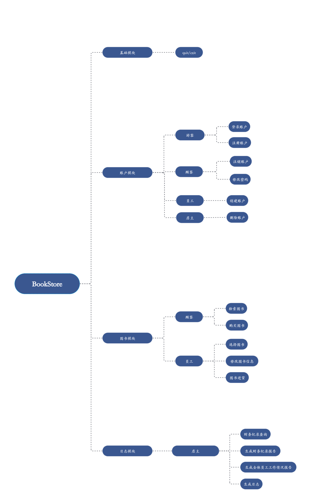

# Bookstore 总体开发文档
> * 项目名称：Bookstore
> * 文档作者：许佳琪
---
## 程序功能概述
- 管理账户系统
    - 维护账户信息
    - 实现账户相关指令
- 管理图书系统
    - 维护图书信息
    - 实现图书相关指令
- 管理日志系统
    - 维护日志信息
    - 实现日志相关指令
---
## 主体逻辑说明
开始程序  
循环{  
读取指令  
若(指令不合法) 抛出错误  
否则 执行指令  
}

---
## 代码文件结构
### main.cpp
作为程序的主入口点，负责启动程序、调用各种指令。
### File.hpp/File.cpp
包含文件读写、数据存储相关的函数。
### Account.hpp/Account.cpp
包含实现账户相关指令的函数。
### Book.hpp/Book.cpp
包含实现图书相关指令的函数。
### Diary.hpp/Diary.cpp
包含实现日志相关指令的函数。
### TokenScanner.hpp/TokenScanner.cpp
包含检查指令合法性的函数。
### error.hpp/error.cpp
包含检查指令合法性、抛出错误的函数。

---
## 功能设计
### 基础模块
- quit/exit：退出系统
### 账户模块
- 游客
  - 登录账户：使登录帐户变为已登录状态，当前帐户变为该帐户
  - 注册账户：注册权限等级为{1}的账户
- 顾客
  - 注销账户：撤销最后一次成功执行的登录指令效果
  - 修改密码：修改指定帐户的密码
- 员工
  - 创建账户：创建一个账户
- 店主
  - 删除账户：删除特定账户
### 图书模块
- 顾客
  - 检索图书：以 [ISBN] 字典升序依次输出满足要求的图书信息
  - 购买图书：购买指定数量的指定图书，以浮点数输出购买图书所需的总金额。
- 员工
  - 选择图书：以当前帐户选中指定图书
  - 修改图书信息：以指令中的信息更新选中图书的信息
  - 图书进货：以指定交易总额购入指定数量的选中图书，增加其库存数
### 日志模块
- 店主
  - 财务纪录查询
  - 生成财务纪录报告
  - 生成全体员工工作情况报告
  - 生成日志

---
## 数据库设计
### 账户信息
- 需要存储的信息：
  - [UserID]（独特）, [Password]  
    合法字符集：数字，字母，下划线；   
    最大长度：30。
  - [Username]  
    合法字符集：除不可见字符以外 ASCII 字符；  
    最大长度：30。
  - [Privilege]  
    合法字符集：数字；  
    最大长度：1。
- 存储方式：userID.txt存头结点，account.txt存块
### 图书信息
- 需要存储的信息：
  - [ISBN]（独特）  
    合法字符集：除不可见字符以外 ASCII 字符；  
    最大长度：20；
  - [BookName], [Author]  
    合法字符集：除不可见字符和英文双引号以外 ASCII 字符；  
    最大长度：60。
  - [Keyword]  
    合法字符集：除不可见字符和英文双引号以外 ASCII 字符；  
    最大长度：60；  
    特殊说明：[keyword] 内容以 | 为分隔可以出现多段信息。
  - [Inventory]  
    合法字符集：数字；  
    最大长度：10；  
    特殊说明：数值不超过 2'147'483'647。
  - [Price]  
    合法字符集：数字和 .；  
    最大长度：13；  
    特殊说明：本系统中浮点数输入输出精度固定为小数点后两位。
- 存储方式：
  - ISBN.txt存头结点，ISBN-body.txt存块
  - name.txt存头结点，name-body.txt存块
  - author.txt存头结点，author-body.txt存块
  - keyword.txt存头结点，keyword-body.txt存块
### 日志信息
- 需要存储的信息：
  - 交易金额：  
    支出/收入  
    金额大小
  - 员工工作情况：  
    操作类型  
    操作内容
- 存储方式：
  - finance.txt存财务纪录
  - employee.txt存头结点，employee-body.txt存员工工作情况
---
## 类、结构体设计
- Account类：登录账户、注册账户、注销账户、修改密码、创建账户、删除账户
- Book类：检索图书、购买图书、选择图书、修改图书信息、图书进货
- Diary类：财务纪录查询、生成财务纪录报告、生成全体员工工作情况报告、生成日志
- error类：抛出错误
- Memory类：对不同对象进行存储，实现文件读写
- TokenScanner类：检查指令合法性
---
## 其他补充说明
无